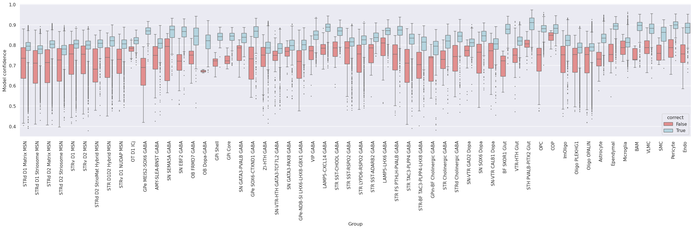

# Cell Type Mapping Evaluation on Primate Basal Ganglia Taxonomies

*The latest Allen Institute Basal Ganglia Taxonomy datasets released in Q2 2025 are used in this tutorial and are available [publicly for download](https://alleninstitute.github.io/HMBA_BasalGanglia_Consensus_Taxonomy).*

## Overview
Allen Institute Taxonomies are defined by clusters of cells that meet criteria establishing a level of distinctness in the cells' transcriptomic signature. Application of a given taxonomy typically involves annotation of new cells against the cell type hierarchy, starting from clusters and moving up into broader cell categories. However, not all clusters are equal in how well they can be annotated onto new data for various reasons, such as cutting gradients or lacking distinct markers.

***To provide transparency into taxonomy labeling and mapping algorithm biases and accuracies when mapping cell type labels using Allen Institute taxonomies as references, we have designed a cell type mapping evaluation procedure.*** The image below illustrates the idea of this tutorial, which is to evaluate cell type reproducibility by self-projecting the taxonomy. For each of the K-Fold smaller sets new marker genes are selected each time. The main question this tutorial answers is: "How reproducible and accurate are Allen Institute taxonomy labels when used for mapping new single-cell datasets, and how do biases in the mapping algorithm affect this process?"

# Data
This tutorial evaluates the Marmoset Basal Ganglia (et al. 2025) using Correlation and Hierarchical Mapping algorithms. However, **Human** and **Macaque** taxonomies are also shared. Marmoset is the smallest and therefore used for this tutorial. [Link to Human, Macaque, and Marmoset taxonomies] (https://alleninstitute.github.io/HMBA_BasalGanglia_Consensus_Taxonomy/)

The marmoset taxonomy was initially built using the Basal Ganglia (BG) area single-nucleus dataset. In building the taxonomy, binary marker genes were selected based on their gene expression from the single-cell transcriptome. Subsequently, the dataset was mapped to itself, termed self-projection, for evaluating the ideal performance of correlation and hierarchical mapping algorithms.

# Mapping Algorithms
This tutorial uses two mapping algorithms:
1. CORRELATION MAPPING: one-step nearest cluster centroid mapping based on correlation
2. HIERARCHICAL CORRELATION MAPPING: hierarchical nearest cluster centroid mapping based on correlation

Algorithm descriptions are available at: https://portal.brain-map.org/atlases-and-data/bkp/mapmycells/algorithms.

# Tutorial 
The code for the tutorial is in this repository named "tutorial.ipynb". The code takes about 15-20mins to run using the subsampled Marmoset Taxonomy. It will be faster or take longer depending on the dataset size. 

# Results
Below are the results of the analysis to evaluate the predictions of correlation and hierarchical mappings in determining cluster labels in a self-projection evaluation:

## To analyze the results:
1. Most groups have very high F1-scores (>0.9), suggesting that your taxonomy mapping procedure works robustly across the majority of clusters.
2. ***Confidence values*** from the models are a mostly reliable at distinguishing between True positives and False positives.
3. A few groups dip below the bulk trend. For example, one oligodendrocyte cluster (ImOligo) looks like it has a noticeably lower F1-score compared to the others (closer to ~0.7–0.8).
This suggests that these clusters are less reproducible in cross-validation, possibly because:
- They overlap with neighboring subtypes (continuous gradients).
- They lack distinct marker genes.
- Sample size is smaller, which reduces stability.
4. There is some confusion in the MSNs, specifically STRd D1 and STRd D2 MSNs.
5. Lower F1-score groups should be flagged as “less stable” — they might require:
- More robust marker selection,
- Collapsing into broader categories,
- Or additional orthogonal evidence (spatial localization, morphology).
